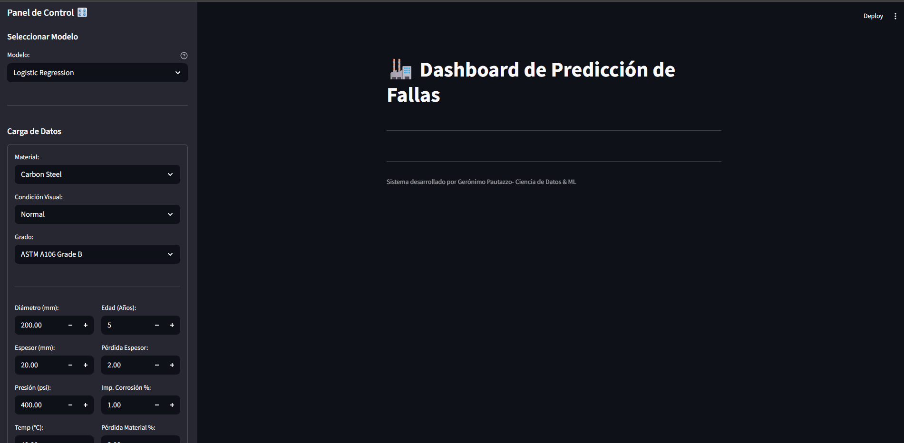

# 🏭 Monitor de Integridad de Tuberías (Pipeline Integrity Monitor)


> **Sistema End-to-End de Machine Learning para mantenimiento predictivo en la industria de Oil & Gas.**

Este proyecto implementa una arquitectura desacoplada para predecir fallas en ductos basándose en condiciones operativas y físicas. Simula un entorno de producción real utilizando **FastAPI** para el backend de inferencia y **Streamlit** para el dashboard de control.

---


<div align="center">
  
  <p><i>Demostración en tiempo real: Funcionamiento del Dashboard</i></p>
</div>


## 🏗️ Arquitectura del Proyecto

El sistema está dividido en dos microservicios:

1.  **Cerebro (API REST - FastAPI):** - Carga modelos de ML (XGBoost, Random Forest, Logistic Regression).
    - Valida datos de entrada con **Pydantic**.
    - Expone endpoints para inferencia en tiempo real.
    
2.  **Interfaz (Frontend - Streamlit):**
    - Panel de control para ingenieros de campo.
    - Comunicación vía HTTP Requests con la API.
    - **Visualización Avanzada:** Incluye análisis de riesgo con degradé de colores y mapa de anomalías usando **PCA** (Principal Component Analysis) para comparar nuevos casos con el historial de fallas.

## 📸 Demo Visual

### 1. Panel de Control y Configuración
El usuario puede seleccionar el modelo y cargar los parámetros físicos del ducto.
*(Acá iría tu captura del formulario)*

### 2. Predicción y Análisis de Riesgo
Visualización clara del riesgo y gráficos de apoyo.
*(Acá iría tu captura del resultado con la barra de colores)*

---

## 🚀 Tecnologías Utilizadas

* **Lenguaje:** Python 3.10+
* **ML Core:** Scikit-Learn, XGBoost, Pandas.
* **Backend:** FastAPI, Uvicorn.
* **Frontend:** Streamlit, Plotly.

## 🛠️ Instalación y Uso Local

1.  **Clonar el repositorio:**
    ```bash
    git clone [https://github.com/](https://github.com/)geronimo290/Proyecto_integrador_frameworks.git
    ```

2.  **Instalar dependencias:**
    ```bash
    pip install -r requirements.txt
    ```

3.  **Ejecutar:**
    ```bash
    python -m uvicorn api.main:app --reload
    python -m streamlit run dashboard/app.py
    
    ```

---

## 👤 Autor

**Gerónimo Pautazzo**
* [LinkedIn]([https://www.linkedin.com/in/gero-pautazzo-88900325a/])
